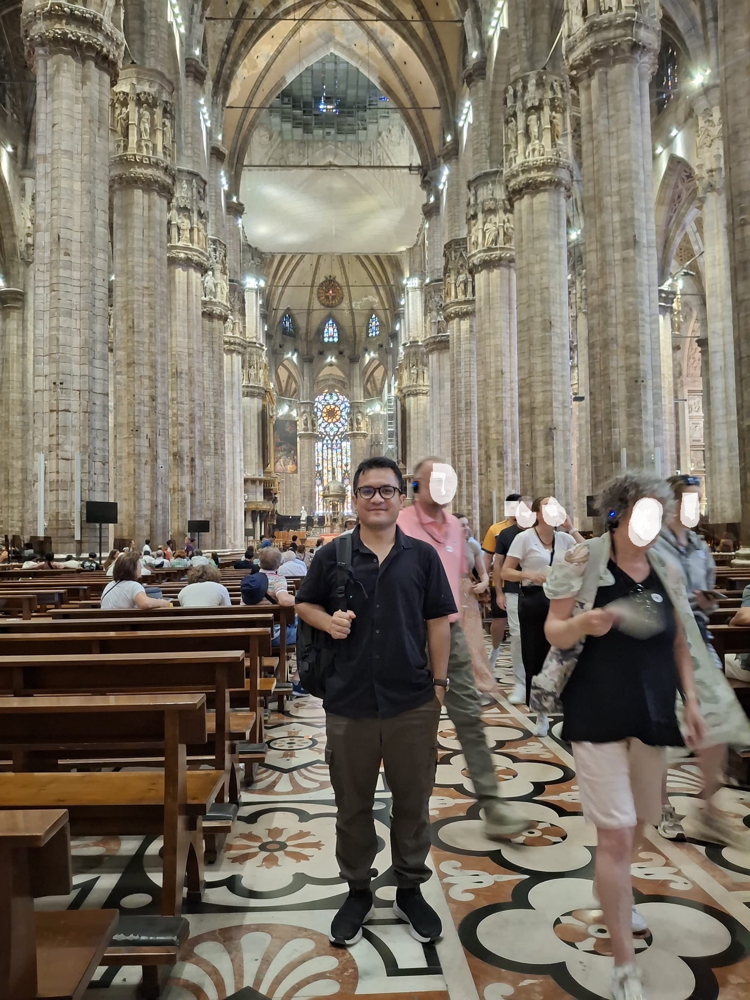

<!DOCTYPE html>
<html lang="en">
<head>
<meta charset="UTF-8">
<meta name="viewport" content="width=device-width, initial-scale=1.0">
<title>Rial Arifin Rajagukguk, PhD</title>
<link rel="preconnect" href="https://fonts.googleapis.com">
<link rel="preconnect" href="https://fonts.gstatic.com" crossorigin>
<link href="https://fonts.googleapis.com/css2?family=Space+Grotesk:wght@400;500;600;700&family=Inter:wght@400;500;600&family=IBM+Plex+Mono:wght@400;500&display=swap" rel="stylesheet">

</head>
<body>

<nav>
  

    

      <svg width="20" height="20" viewBox="0 0 40 40">
        <circle cx="20" cy="20" r="18" fill="none" stroke="#4f92ab" stroke-width="1" opacity="0.6"/>
        <circle cx="20" cy="20" r="11" fill="none" stroke="#4f92ab" stroke-width="1" opacity="0.4"/>
        <circle cx="27" cy="13" r="3.2" fill="#f2a93b"/>
      </svg>
      Rajagukguk
    

    

      <a href="#about">About</a>
      <a href="#education">Education</a>
      <a href="#experience">Experience</a>
      <a href="#publications">Publications</a>
      <a href="#projects">Projects</a>
      <a href="#credentials">Awards</a>
      <a href="#conferences">Conferences</a>
    

  

</nav>

  <!-- HERO -->
  <section class="hero" id="about" style="border-top:none;">
    

      

        
Solar Irradiance &middot; Remote Sensing &middot; Applied ML

        <h1>Rial Arifin Rajagukguk, PhD</h1>
        
I build machine learning models that read the sky — turning sky‑camera and satellite imagery into solar irradiance forecasts for electric vehicles, buildings, and livestock environments.

        

          <a class="pill" href="https://scholar.google.com/citations?user=WdMsyCMAAAAJ&hl=en" target="_blank" rel="noopener">Google Scholar</a>
          <a class="pill" href="https://github.com/rialarifin" target="_blank" rel="noopener">GitHub</a>
          <a class="pill" href="https://www.linkedin.com/in/rialarifin/" target="_blank" rel="noopener">LinkedIn</a>
          <a class="pill" href="https://www.researchgate.net/profile/Rial-Rajagukguk-2" target="_blank" rel="noopener">ResearchGate</a>
        

      

      

        

          
          <svg class="ring-overlay" viewBox="0 0 320 320" xmlns="http://www.w3.org/2000/svg">
            <circle cx="160" cy="160" r="150" fill="none" stroke="rgba(20,32,46,0.14)" stroke-width="1"/>
            <circle cx="160" cy="160" r="100" fill="none" stroke="rgba(47,111,136,0.4)" stroke-width="1"/>
            <circle cx="160" cy="160" r="50" fill="none" stroke="rgba(47,111,136,0.28)" stroke-width="1"/>
            <line x1="160" y1="10" x2="160" y2="310" stroke="rgba(20,32,46,0.08)"/>
            <line x1="10" y1="160" x2="310" y2="160" stroke="rgba(20,32,46,0.08)"/>
          </svg>
        

        
// sky‑camera view, 08:24 KST

      

    

  </section>

  <!-- ABOUT -->
  <section>
    

      
As a researcher, I work across <strong>computer vision</strong>, <strong>machine learning</strong>, <strong>deep learning</strong>, <strong>remote sensing</strong>, <strong>electric vehicles</strong>, <strong>satellite technology</strong>, <strong>sky cameras</strong>, and <strong>solar energy</strong> — disciplines that meet at the point where atmospheric data becomes a usable prediction.

      
My flagship project predicts solar irradiance by fusing sky‑camera and satellite imagery, feeding real‑time forecasts to <strong>electric vehicles in motion</strong> so they can optimize energy consumption ahead of the sun. It's a small piece of a larger goal: cutting carbon emissions by making renewable energy easier to plan around.

    

  </section>

  <!-- EDUCATION -->
  <section id="education">
    
01<h2>Education</h2>

    

      

        2021 — 2024
        <h3>PhD, Kookmin University</h3>
        
South Korea · <a href="https://english.kookmin.ac.kr" target="_blank" rel="noopener">english.kookmin.ac.kr</a>

        
"Solar Radiation Prediction Based on the Images of Satellite and Sky Camera for the Energy Management of Electric Vehicles"

      

      

        2019 — 2021
        <h3>MSc, Kookmin University</h3>
        
South Korea · <a href="https://english.kookmin.ac.kr" target="_blank" rel="noopener">english.kookmin.ac.kr</a>

        
"Solar Irradiance Forecasting using Sky Images"

      

      

        2012 — 2017
        <h3>BSc, Institut Teknologi Bandung</h3>
        
Indonesia · <a href="https://www.itb.ac.id/" target="_blank" rel="noopener">itb.ac.id</a>

        
"Parametric Study of Cooling Film and Implementation on One Axial Turbine Blade Stage"

      

    

  </section>

  <!-- EXPERIENCE -->
  <section id="experience">
    
02<h2>Work Experience</h2>

    

      

        Jul 2025 — now
        <h3>Postdoctoral Researcher</h3>
        
<a href="https://www.afel-jnu.info/research-projects" target="_blank" rel="noopener">Agricultural Facilities and Environment Lab</a> · Chonnam National University

        <ul><li>Livestock Transport 4.0: eco‑friendly animal welfare transport solutions.</li></ul>
      

      

        Sep 2024 — Jun 2025
        <h3>Postdoctoral Researcher</h3>
        
<a href="https://relab.kookmin.ac.kr/home" target="_blank" rel="noopener">Renewable Energy Lab</a> · Kookmin University

        <ul><li>Solar irradiance and cabin air temperature forecasting for moving electric vehicles.</li></ul>
      

      

        2019
        <h3>Student Researcher — Master's &amp; PhD</h3>
        
<a href="https://relab.kookmin.ac.kr/home" target="_blank" rel="noopener">Renewable Energy Lab</a> · Kookmin University

        <ul>
          <li>Calculated cloud motion vectors from satellite images using optical flow and computer vision (Python/OpenCV) for solar irradiance forecasting.</li>
          <li>Estimated minute‑level solar radiation time series across South Korea with RNN, LSTM, GRU, and CNN models.</li>
          <li>Separated direct and diffuse irradiance from global horizontal irradiance using deep learning and transfer learning.</li>
          <li>Forecasted cloud fraction at very short‑term horizons using sky‑camera imagery.</li>
          <li>Forecasted solar irradiance, temperature, and humidity for electric‑vehicle energy saving.</li>
        </ul>
      

      

        2017
        <h3>CFD Engineer</h3>
        
<a href="https://www.chromaintegrated.com/" target="_blank" rel="noopener">PT. Chroma International</a> · Bandung, Indonesia

        <ul>
          <li>Designed and ran CFD analysis on a small‑scale blow‑down wind tunnel operating at supersonic (Mach 2.0) and subsonic (Mach 0.6) conditions.</li>
          <li>Designed and analyzed a 100 kW axial turbine.</li>
        </ul>
      

    

  </section>

  <!-- PUBLICATIONS -->
  <section id="publications">
    
03<h2>Published Papers</h2>

    

      
2026

      

        
<a href="https://doi.org/10.4081/jae.2026.2096" target="_blank" rel="noopener">Estimating Indoor Heat Stress in Livestock Facilities Using High-Resolution Geo-KOMPSAT-2A Satellite Data</a>

        
Rial A. Rajagukguk, Jinseon Park, Heejou Kim, Chae-rin Lee, Se-yeon Lee, Ji-yeon Park, Taehwan Ha, Se-woon Hong

        
Journal of Agricultural Engineering

      

      

        
<a href="https://www.espublisher.com/journals/articledetails/2171" target="_blank" rel="noopener">Feature Selection and Interpretability in Satellite-Based Solar Irradiance Estimation: Optimizing GEO-KOMPSAT-2A Multispectral Inputs for Tropical Environments</a>

        
Rial A. Rajagukguk, Rezi Delfianti, Se-Woon Hong, Indra Ardhanayudha Aditya, Arief Heru Kuncoro, Sudirman Palaloi, Nur Aryanto Aryono, La Ode Muhammad Abdul Wahid, Supratikno, Murbantan Tandirerung, Pranda M.P. Garniwa, Hyunjin Lee

        
Engineered Science

      

      

        
<a href="https://www.korseaj.org/selectArticleInfo.do?article_a_no=HGNHB8_2026_v45_1&ano=HGNHB8_2026_v45_1" target="_blank" rel="noopener">Field Evaluation of Human Exposure to Pesticides and Comparison with Exposure Assessment Models: Drone and Wide-area Sprayer Applications</a>

        
Se-yeon Lee, Ji-yeon Park, Jinseon Park, Chae-rin Lee, Rial A. Rajagukguk, Youngho Kang, Hyun Ho Noh, Se-woon Hong

        
Agricultural and Environmental Sciences

      

      

        
<a href="https://www.sciencedirect.com/science/article/pii/S2352484726001095" target="_blank" rel="noopener">Solar Energy Estimation in Tropical Environments: A Novel Framework for Integrating Satellite and Sky Imager Data</a>

        
Aditya, I. A., M. Soleh, H. Lee, P. M.P. Garniwa, M. F.B. Suhaimi, S.-W. Hong, Rial A. Rajagukguk

        
Energy Reports

      

    

    

      
2025

      

        
<a href="https://www.nature.com/articles/s41598-025-31719-2" target="_blank" rel="noopener">Dynamic Solar Irradiance Estimation for Vehicle Thermal Management Using a Multi-Modal Machine Learning Framework</a>

        
Rial A. Rajagukguk, Hoseong Lee, Hyunjin Lee

        
Scientific Reports

      

      

        
<a href="https://www.sciencedirect.com/science/article/pii/S2772375525007701" target="_blank" rel="noopener">Deep Learning for Visual Animal Monitoring (Detection, Tracking, Pose Estimation, and Behavior Classification): A Comprehensive Review</a>

        
Rial A. Rajagukguk, Se-yeon Lee, Ji-yeon Park, Kehinde FavourDaniel, Chae-rin Lee, ZhengChencDongLiu, TomásNorton, Jinseon Park, Se-woon Hong

        
Smart Agricultural Technology

      

      

        
<a href="https://www.nature.com/articles/s41598-025-91158-x" target="_blank" rel="noopener">Application of Explainable Machine Learning for Estimating Direct and Diffuse Components of Solar Irradiance</a>

        
Rial A. Rajagukguk, Hyunjin Lee

        
Scientific Reports

      

    

    

      
2024

      

        
<a href="https://doi.org/10.1016/j.buildenv.2024.112429" target="_blank" rel="noopener">Sky-Image-Based Sun-Blocking Index and PredRNN++ for Accurate Short-Term Solar Irradiance Forecasting</a>

        
Rial A. Rajagukguk, Hyunjin Lee

        
Building and Environment

      

      

        
<a href="https://ieeexplore.ieee.org/document/10667941" target="_blank" rel="noopener">Estimating Irradiance through Satellite-Driven Deep Learning Models</a>

        
Indra A. Aditya, Pranda M. Putra, Rial A. Rajagukguk, Yessy Asri

        
International Seminar on Intelligent Technology and Its Applications

      

    

    

      
2023

      

        
<a href="https://www.ksesjournal.co.kr/articles/xml/qVn9/" target="_blank" rel="noopener">Enhancing the Performance of Solar Radiation Decomposition Models Using Deep Learning</a>

        
Rial A. Rajagukguk, Hyunjin Lee

        
Journal of the Korean Solar Energy Society

      

      

        
<a href="https://doi.org/10.1016/j.solener.2023.01.037" target="_blank" rel="noopener">Intra-day Forecast of Global Horizontal Irradiance Using Optical Flow Method and Long Short-Term Memory Model</a>

        
Pranda M. Putra, Rial A. Rajagukguk, R. Kamil, Hyunjin Lee

        
Solar Energy

      

    

    

      
2022

      

        
<a href="https://doi.org/10.1016/j.buildenv.2022.109481" target="_blank" rel="noopener">Sun Blocking Index (SBI) from Sky Image to Estimate Solar Irradiance</a>

        
Rial A. Rajagukguk, Won-Ki Choi, Hyunjin Lee

        
Building and Environment

      

    

    

      
2021

      

        
<a href="https://www.mdpi.com/2076-3417/11/11/5049" target="_blank" rel="noopener">A Deep Learning Model to Forecast Solar Irradiance Using a Sky Camera</a>

        
Rial A. Rajagukguk, R. Kamil, Hyunjin Lee

        
Applied Sciences, 11(11), 5049

      

    

    

      
2020

      

        
<a href="https://www.mdpi.com/1996-1073/13/24/6623" target="_blank" rel="noopener">A Review on Deep Learning Models for Forecasting Time Series Data of Solar Irradiance and Photovoltaic Power</a>

        
Rial A. Rajagukguk, Raden A. A. Ramadhan, Hyunjin Lee

        
Energies, 13(24), 6623

      

    

  </section>

  <!-- PROJECTS -->
  <section id="projects">
    
04<h2>Projects</h2>

    

      

        <h3>Perusahaan Listrik Negara (PT PLN)</h3>
        
Jakarta, Indonesia

        <ul>
          <li>Solar irradiance estimation using sky camera</li>
          <li>Solar irradiance forecasting using sky camera and satellite image</li>
        </ul>
      

      
05/2024 — present

    

    

      

        <h3>Korea Evaluation Institute of Industrial Technology (KEIT)</h3>
        
Seoul, Korea

        <ul>
          <li>Thermal management system to reduce energy consumption and optimize the mileage of electric vehicles</li>
        </ul>
      

      
04/2022 — 12/2025

    

    

      

        <h3>National Research Foundation of Korea (NRF)</h3>
        
Seoul, Korea

        <ul>
          <li>Machine-learning-linked solar radiation model to predict solar irradiance</li>
        </ul>
      

      
03/2019 — 02/2023

    

    

      

        <h3>SONUSYS Co., Ltd</h3>
        
Seoul, Korea

        <ul>
          <li>Controlling the window based on solar radiation components</li>
        </ul>
      

      
04/2021 — 10/2021

    

  </section>

  <!-- AWARDS / PATENT -->
  <section id="credentials">
    
05<h2>Awards &amp; Patent</h2>

    

      

        Award
        
Best Poster Presentation

        
Korean Society of Animal Environmental Science &amp; Technology (KSAEST) 2026 · Cheongju, South Korea · 12 Jun 2026

      

      

        Award
        
Best Paper

        
The Korean Solar Energy Society (KSES) 2023 · Yeosu, South Korea · 8 Nov 2023

      

      

        Patent
        
구름 특성 기반 일사량 추정 시스템 및 방법 (Cloud-characteristic-based solar irradiance estimation system and method)

        
Korean Intellectual Property Office · 2024

      

    

  </section>

  <!-- CONFERENCES -->
  <section id="conferences">
    
06<h2>International Conferences</h2>

    

      <h3><a href="https://www.cigr-eurageng-2026.org" target="_blank" rel="noopener">Joint CIGR–EurAgEng World Congress 2026</a></h3>
      
Politecnico di Torino, Italy · 24–26 Jun 2026

      
Satellite-Driven Estimation of Indoor Heat Stress in Livestock Facilities Using Machine Learning and GEO-KOMPSAT-2A Data

      
Developing an Integrated Safety and Welfare Assessment System for Livestock Transport Vehicles in Korea

    

    

      <h3><a href="https://event.asme.org/ES-2023" target="_blank" rel="noopener">ASME Energy Sustainability (ASME ES 2023)</a></h3>
      
The Madison Hotel, Washington, DC · 10–12 Jul 2023

      
Minute-level solar irradiance estimation via sun-blocking index derived from sky images

    

    

      <h3><a href="https://www.ksnre.or.kr/afore/2022/" target="_blank" rel="noopener">11th Asia-Pacific Forum in Renewable Energy (AFORE 2022)</a></h3>
      
Ramada Plaza Jeju, South Korea · 27 Sep – 1 Oct 2022

      
Estimation of minute level of solar irradiance using sun-blocking index (SBI) derived from sky images

    

    

      <h3><a href="https://acts2020jp.org/" target="_blank" rel="noopener">2nd Asian Conference on Thermal Sciences (2nd ACTS)</a></h3>
      
Japan · 3–7 Oct 2021

      
Evaluation of decomposition models to estimate direct normal irradiance using sub-hour data

    

  </section>

  <footer>
    Rial Arifin Rajagukguk, PhD — Renewable Energy · Remote Sensing · Applied ML
  </footer>

</body>
</html>
